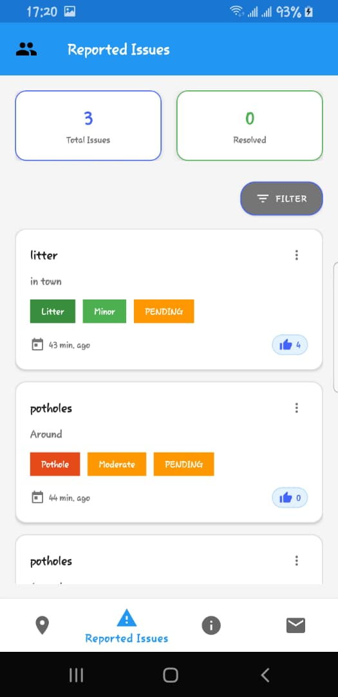

# CivicWatch - Community Issue Reporting Platform

<div align="center">


<h3>Empowering Communities Through Technology</h3>

[](https://developer.android.com)
[](https://java.com)
[](https://firebase.google.com)
[](https://developers.google.com/maps)
[](LICENSE)

</div>

## Overview

CivicWatch is an Android application that enables citizens to report, track, and resolve community issues in real-time. Transform civic engagement with a modern, intuitive platform for reporting potholes, graffiti, litter, and other community concerns.

---

## 📱 Screenshots

<div align="center">

| | | |
|:---:|:---:|:---:|
| **Issues Map** | **Report Issue** | **Issues Dashboard** |
|  |  |  |
| Interactive map view | Issue reporting interface | Community issues list |

</div>

## ✨ Features

### 🗺️ **Interactive Mapping**
- Real-time issue visualization on Google Maps
- Custom markers for different issue categories
- Tap-to-select location for precise reporting
- Cluster markers for dense urban areas

### 📝 **Smart Reporting**
- Photo capture with camera or gallery
- 10+ categorized issue types
- Severity classification (Minor to Critical)
- Detailed description fields
- Automatic GPS location detection

### 📊 **Community Dashboard**
- Browse all reported issues with filtering
- Upvote system for issue prioritization
- Status tracking (Pending → In Progress → Resolved)
- Color-coded status indicators

### 🔄 **Real-time Updates**
- Firebase-powered instant synchronization
- Live upvote counting
- Push notification support
- Multi-user collaboration

## 🏗️ Project Structure
CivicWatch/
├── app/
│ ├── src/main/
│ │ ├── java/com/mihneacristian/civicwatch/
│ │ │ ├── presentation/
│ │ │ │ ├── activities/
│ │ │ │ │ └── MainActivity.java
│ │ │ │ ├── fragments/
│ │ │ │ │ ├── MapFragment.java
│ │ │ │ │ ├── IssuesFragment.java
│ │ │ │ │ └── AboutFragment.java
│ │ │ │ └── adapters/
│ │ │ │ └── IssuesAdapter.java
│ │ │ ├── data/
│ │ │ │ └── model/
│ │ │ │ └── Issue.java
│ │ │ └── utils/
│ │ │ ├── MapMarkerUtils.java
│ │ │ └── ImageUtils.java
│ │ └── res/
│ │ ├── layout/
│ │ │ ├── fragment_map.xml
│ │ │ ├── fragment_issues.xml
│ │ │ ├── fragment_about.xml
│ │ │ ├── item_issue.xml
│ │ │ └── layout_bottom_sheet.xml
│ │ ├── drawable/
│ │ │ ├── ic_civicwatch.png
│ │ │ ├── ic_map.xml
│ │ │ ├── ic_list.xml
│ │ │ └── ... (other icons)
│ │ ├── values/
│ │ │ ├── colors.xml
│ │ │ ├── strings.xml
│ │ │ └── styles.xml
│ │ └── menu/
│ │ └── menu_issue_item.xml
│ └── build.gradle
├── docs/
│ └── images/
│ ├── ic_civicwatch.png
│ ├── IssuesMap.jpeg
│ ├── ReportNewIssue.jpeg
│ ├── ReportedIssues.jpeg
│ └── AboutUs.jpeg
├── .gitignore
├── build.gradle
├── settings.gradle
└── README.md

### Key Components

1. **MainActivity.java** - Navigation controller with bottom navigation
2. **MapFragment.java** - Google Maps integration with issue markers
3. **IssuesFragment.java** - Issues list with filtering and upvoting
4. **AboutFragment.java** - App information and details
5. **IssuesAdapter.java** - RecyclerView adapter for issues list
6. **Issue.java** - Data model for issue entities
7. **MapMarkerUtils.java** - Custom marker icon generation
8. **ImageUtils.java** - Image processing utilities

## 🚀 Quick Start

### Prerequisites
- Android Studio 2022.3+
- Android SDK 21+
- Java JDK 8+
- Google Maps API Key
- Firebase Account

### Installation
1. **Clone the repository**
   ```bash
   git clone https://github.com/MusumbaAbeljr055/civicwatch.git
   cd civicwatch
